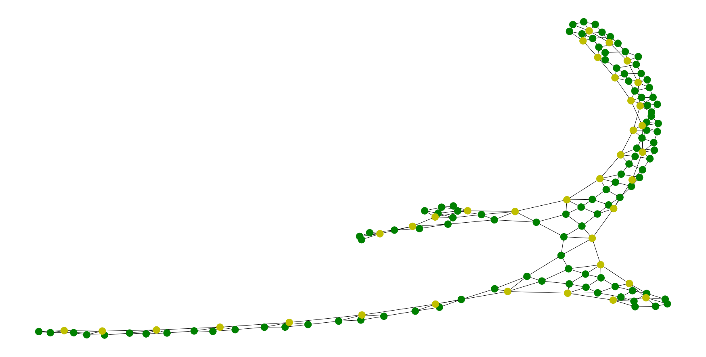

```python
# 查看当前挂载的数据集目录, 该目录下的变更重启环境后会自动还原
# 这里可以看到我们数据集的名称为: data60987
!ls /home/aistudio/data
```

    data60987


```python
# paddlepaddle 在aistudio中已经默认安装好了. 版本为1.8.4
# 这里我们只需要安装图学习框架PGL
!pip install pgl -q  # 安装PGL
```


```python
# 主要代码文件在./src目录
%cd ./src
```

    /home/aistudio/src


```python
import json
import random
import numpy as np
import pandas as pd

import matplotlib.pyplot as plt
import networkx as nx

from utils.config import prepare_config, make_dir
from utils.logger import prepare_logger, log_to_file
from data_parser import GraphParser

seed = 123
np.random.seed(seed)
random.seed(seed)
```


```python
# https://www.kaggle.com/c/stanford-covid-vaccine/data

df = pd.read_json('../data/data60987/train.json', lines=True)
sample = df.loc[0]
print(sample)
```

    SN_filter                                                              0
    deg_50C                [0.0, 0.0, 0.0, 0.0, 0.0, 0.0, 0.0, 0.0, 0.0, ...
    deg_Mg_50C             [0.0, 0.0, 0.0, 0.0, 0.0, 0.0, 0.0, 0.0, 0.0, ...
    deg_Mg_pH10            [0.0, 0.0, 0.0, 0.0, 0.0, 0.0, 0.0, 0.0, 0.0, ...
    deg_error_50C          [191738.0886, 191738.0886, 191738.0886, 191738...
    deg_error_Mg_50C       [171525.3217, 171525.3217, 171525.3217, 171525...
    deg_error_Mg_pH10      [104235.1742, 104235.1742, 104235.1742, 104235...
    deg_error_pH10         [222620.9531, 222620.9531, 222620.9531, 222620...
    deg_pH10               [0.0, 0.0, 0.0, 0.0, 0.0, 0.0, 0.0, 0.0, 0.0, ...
    id                                                          id_2a7a4496f
    index                                                                400
    predicted_loop_type    EEEEESSSHHHSSSSSSSSSSSSSSSSSSSSSSSISSSSHHHHSSS...
    reactivity             [0.0, 0.0, 0.0, 0.0, 0.0, 0.0, 0.0, 0.0, 0.0, ...
    reactivity_error       [146151.225, 146151.225, 146151.225, 146151.22...
    seq_length                                                           107
    seq_scored                                                            68
    sequence               GGAAAGCCCGCGGCGCCGGGCGCCGCGGCCGCCCAGGCCGCCCGGC...
    signal_to_noise                                                        0
    structure              .....(((...)))((((((((((((((((((((.((((....)))...
    Name: 0, dtype: object


```python
args = prepare_config("./config.yaml", isCreate=False, isSave=False)
parser = GraphParser(args)
gdata = parser.parse(sample)
```


```python
gdata
```


    {'nfeat': array([[0., 0., 0., ..., 0., 0., 0.],
            [0., 0., 0., ..., 0., 0., 0.],
            [0., 1., 0., ..., 0., 0., 0.],
            ...,
            [1., 0., 0., ..., 0., 0., 0.],
            [1., 0., 0., ..., 0., 0., 0.],
            [1., 0., 0., ..., 0., 0., 0.]], dtype=float32),
     'edges': array([[  0,   1],
            [  1,   0],
            [  1,   2],
            ...,
            [142, 105],
            [106, 142],
            [142, 106]]),
     'efeat': array([[ 0.,  0.,  0.,  1.,  1.],
            [ 0.,  0.,  0., -1.,  1.],
            [ 0.,  0.,  0.,  1.,  1.],
            ...,
            [ 0.,  1.,  0.,  0.,  0.],
            [ 0.,  1.,  0.,  0.,  0.],
            [ 0.,  1.,  0.,  0.,  0.]], dtype=float32),
     'labels': array([[ 0.    ,  0.    ,  0.    ],
            [ 0.    ,  0.    ,  0.    ],
            [ 0.    ,  0.    ,  0.    ],
            [ 0.    ,  0.    ,  0.    ],
            [ 0.    ,  0.    ,  0.    ],
            [ 0.    ,  0.    ,  0.    ],
            [ 0.    ,  0.    ,  0.    ],
            [ 0.    ,  0.    ,  0.    ],
            [ 0.    ,  0.    ,  0.    ],
            [ 0.    ,  0.    ,  0.    ],
            [ 0.    ,  0.    ,  0.    ],
            [ 0.    ,  0.    ,  0.    ],
            [ 0.    ,  0.    ,  0.    ],
            [ 0.    ,  0.    ,  0.    ],
            [ 0.    ,  0.    ,  0.    ],
            [ 0.    ,  0.    ,  0.    ],
            [ 0.    ,  0.    ,  0.    ],
            [ 0.    ,  0.    ,  0.    ],
            [ 0.    ,  0.    ,  0.    ],
            [ 0.    ,  0.    ,  0.    ],
            [ 0.    ,  0.    ,  0.    ],
            [ 0.    ,  0.    ,  0.    ],
            [ 0.    ,  0.    ,  0.    ],
            [ 0.    ,  0.    ,  0.    ],
            [ 0.    ,  0.    ,  0.    ],
            [ 0.    ,  0.    ,  0.    ],
            [ 0.    ,  0.    ,  0.    ],
            [ 0.    ,  0.    ,  0.    ],
            [ 0.    ,  0.    ,  0.    ],
            [ 0.    ,  0.    ,  0.    ],
            [ 0.    ,  0.    ,  0.    ],
            [ 0.    ,  0.    ,  0.    ],
            [ 0.    ,  0.    ,  0.    ],
            [ 0.    ,  0.    ,  0.    ],
            [ 0.    ,  0.    ,  0.    ],
            [ 0.    ,  0.    ,  0.    ],
            [ 0.    ,  0.    ,  0.    ],
            [ 0.    ,  0.    ,  0.    ],
            [ 0.    ,  0.    ,  0.    ],
            [ 0.    ,  0.    ,  0.    ],
            [ 0.    ,  0.    ,  0.    ],
            [ 0.    ,  0.    ,  0.    ],
            [ 0.    ,  0.    ,  0.    ],
            [ 0.    ,  0.    ,  0.    ],
            [ 0.    ,  0.    ,  0.    ],
            [ 0.    ,  0.    ,  0.    ],
            [ 0.    ,  0.    ,  0.    ],
            [ 0.    ,  0.    ,  0.    ],
            [ 0.    ,  0.    ,  0.    ],
            [ 0.    ,  0.    ,  0.    ],
            [ 0.    ,  0.    ,  0.    ],
            [ 0.    ,  0.    ,  0.    ],
            [ 0.    ,  0.    ,  0.    ],
            [ 0.    ,  0.    ,  0.    ],
            [ 0.    ,  0.    ,  0.    ],
            [ 0.    ,  0.    ,  0.    ],
            [ 0.    ,  0.    ,  0.    ],
            [ 0.    ,  0.    ,  0.    ],
            [ 0.    ,  0.    ,  0.    ],
            [ 0.    ,  0.    ,  0.    ],
            [ 0.    ,  0.    ,  0.    ],
            [ 0.    ,  0.    ,  0.    ],
            [ 0.    ,  0.    ,  0.    ],
            [ 0.    ,  0.    ,  0.    ],
            [ 0.    ,  0.    ,  0.    ],
            [ 0.    ,  0.    ,  0.    ],
            [20.6648,  0.    ,  0.    ],
            [ 0.    ,  0.    ,  0.    ],
            [ 0.    ,  0.    , 24.2525],
            [ 0.    ,  0.    ,  0.    ],
            [ 0.    ,  0.    ,  0.    ],
            [ 0.    ,  0.    ,  0.    ],
            [ 0.    ,  0.    ,  0.    ],
            [ 0.    ,  0.    ,  0.    ],
            [ 0.    ,  0.    ,  0.    ],
            [ 0.    ,  0.    ,  0.    ],
            [10.3334,  0.    ,  0.    ],
            [ 0.    ,  0.    ,  0.    ],
            [ 0.    ,  0.    ,  0.    ],
            [ 0.    ,  0.    ,  0.    ],
            [ 0.    ,  0.    ,  0.    ],
            [ 0.    ,  0.    ,  0.    ],
            [ 0.    , 14.7381,  0.    ],
            [ 0.    ,  0.    ,  0.    ],
            [ 0.    ,  0.    ,  0.    ],
            [ 0.    ,  7.3698,  0.    ],
            [ 6.8892,  0.    , 12.1275],
            [ 0.    ,  0.    ,  0.    ],
            [ 5.167 ,  9.8271, 12.1281],
            [ 0.    ,  0.    ,  0.    ],
            [ 0.    ,  0.    ,  0.    ],
            [ 0.    ,  2.1058,  0.    ],
            [ 0.    ,  0.    ,  0.    ],
            [ 0.    ,  1.8426,  8.0855],
            [ 0.    ,  1.6379,  0.    ],
            [ 0.    ,  1.4741,  0.    ],
            [ 0.    ,  2.4568,  0.    ],
            [ 0.    ,  2.1058,  0.    ],
            [ 0.    ,  0.9827,  3.4652],
            [ 0.    ,  0.    ,  0.    ],
            [ 0.    ,  0.    ,  3.0321],
            [ 0.    ,  0.9213,  0.    ],
            [ 6.8894,  3.5097,  5.7754],
            [ 0.    ,  1.8426,  6.0642],
            [ 0.    ,  0.    ,  0.    ],
            [ 0.    ,  0.    ,  0.    ],
            [ 0.    ,  0.    ,  0.    ],
            [ 0.    ,  0.    ,  0.    ],
            [ 0.    ,  0.    ,  0.    ],
            [ 0.    ,  0.    ,  0.    ],
            [ 0.    ,  0.    ,  0.    ],
            [ 0.    ,  0.    ,  0.    ],
            [ 0.    ,  0.    ,  0.    ],
            [ 0.    ,  0.    ,  0.    ],
            [ 0.    ,  0.    ,  0.    ],
            [ 0.    ,  0.    ,  0.    ],
            [ 0.    ,  0.    ,  0.    ],
            [ 0.    ,  0.    ,  0.    ],
            [ 0.    ,  0.    ,  0.    ],
            [ 0.    ,  0.    ,  0.    ],
            [ 0.    ,  0.    ,  0.    ],
            [ 0.    ,  0.    ,  0.    ],
            [ 0.    ,  0.    ,  0.    ],
            [ 0.    ,  0.    ,  0.    ],
            [ 0.    ,  0.    ,  0.    ],
            [ 0.    ,  0.    ,  0.    ],
            [ 0.    ,  0.    ,  0.    ],
            [ 0.    ,  0.    ,  0.    ],
            [ 0.    ,  0.    ,  0.    ],
            [ 0.    ,  0.    ,  0.    ],
            [ 0.    ,  0.    ,  0.    ],
            [ 0.    ,  0.    ,  0.    ],
            [ 0.    ,  0.    ,  0.    ],
            [ 0.    ,  0.    ,  0.    ],
            [ 0.    ,  0.    ,  0.    ],
            [ 0.    ,  0.    ,  0.    ],
            [ 0.    ,  0.    ,  0.    ],
            [ 0.    ,  0.    ,  0.    ],
            [ 0.    ,  0.    ,  0.    ],
            [ 0.    ,  0.    ,  0.    ],
            [ 0.    ,  0.    ,  0.    ],
            [ 0.    ,  0.    ,  0.    ],
            [ 0.    ,  0.    ,  0.    ]], dtype=float32),
     'mask': array([[ True],
            [ True],
            [ True],
            [ True],
            [ True],
            [ True],
            [ True],
            [ True],
            [ True],
            [ True],
            [ True],
            [ True],
            [ True],
            [ True],
            [ True],
            [ True],
            [ True],
            [ True],
            [ True],
            [ True],
            [ True],
            [ True],
            [ True],
            [ True],
            [ True],
            [ True],
            [ True],
            [ True],
            [ True],
            [ True],
            [ True],
            [ True],
            [ True],
            [ True],
            [ True],
            [ True],
            [ True],
            [ True],
            [ True],
            [ True],
            [ True],
            [ True],
            [ True],
            [ True],
            [ True],
            [ True],
            [ True],
            [ True],
            [ True],
            [ True],
            [ True],
            [ True],
            [ True],
            [ True],
            [ True],
            [ True],
            [ True],
            [ True],
            [ True],
            [ True],
            [ True],
            [ True],
            [ True],
            [ True],
            [ True],
            [ True],
            [ True],
            [ True],
            [False],
            [False],
            [False],
            [False],
            [False],
            [False],
            [False],
            [False],
            [False],
            [False],
            [False],
            [False],
            [False],
            [False],
            [False],
            [False],
            [False],
            [False],
            [False],
            [False],
            [False],
            [False],
            [False],
            [False],
            [False],
            [False],
            [False],
            [False],
            [False],
            [False],
            [False],
            [False],
            [False],
            [False],
            [False],
            [False],
            [False],
            [False],
            [False],
            [False],
            [False],
            [False],
            [False],
            [False],
            [False],
            [False],
            [False],
            [False],
            [False],
            [False],
            [False],
            [False],
            [False],
            [False],
            [False],
            [False],
            [False],
            [False],
            [False],
            [False],
            [False],
            [False],
            [False],
            [False],
            [False],
            [False],
            [False],
            [False],
            [False],
            [False],
            [False],
            [False],
            [False],
            [False],
            [False]])}


```python

fig = plt.figure(figsize=(24, 12))
nx_G = nx.Graph()
nx_G.add_nodes_from([i for i in range(len(gdata['nfeat']))])

nx_G.add_edges_from(gdata['edges'])
node_color = ['g' for _ in range(sample['seq_length'])] + \
['y' for _ in range(len(gdata['nfeat']) - sample['seq_length'])]
options = {
    "node_color": node_color,
}
pos = nx.spring_layout(nx_G, iterations=400, k=0.2)
nx.draw(nx_G, pos, **options)

plt.show()
```





请点击[此处](https://ai.baidu.com/docs#/AIStudio_Project_Notebook/a38e5576)查看本环境基本用法.  <br>
Please click [here ](https://ai.baidu.com/docs#/AIStudio_Project_Notebook/a38e5576) for more detailed instructions. 
